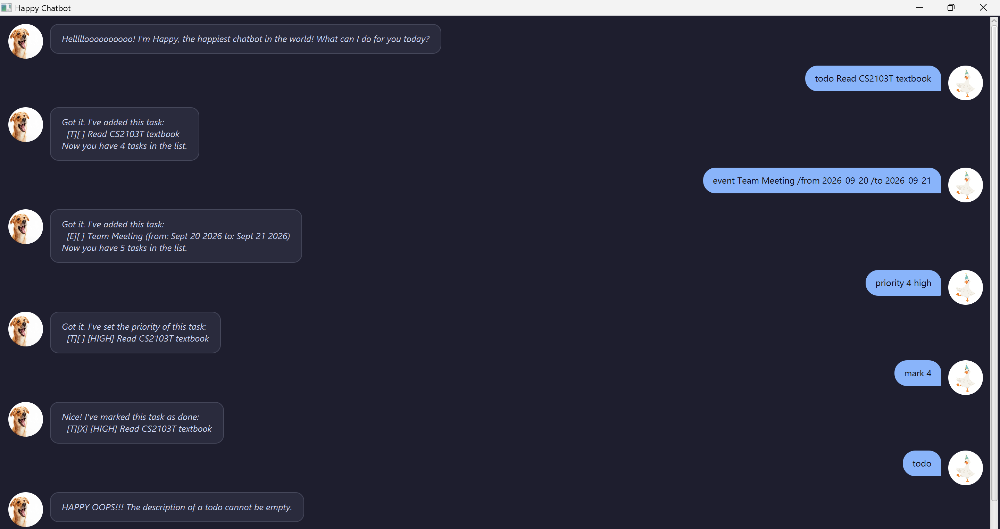

# Happy User Guide

## What is Happy?

**Happy** is the happiest desktop task management chatbot in the world! It helps you track your everyday tasks, deadlines, events, and task priorities through a clean UI in the happiest manner possible!



---

## Quick Start

1. Ensure you have **Java 25** installed on your computer.
2. Download the latest release or clone this repository.
3. Open your terminal in the project directory and launch Happy by running:
   ```bash
   ./gradlew run
   ```
4. Type a command in the text box at the bottom and press **Send** or hit **Enter**!

---

## Features

### 1. Adding a Todo Task: `todo`
Adds a simple task without a specific date or time limit.

* **Format:** `todo <description>`
* **Example:** `todo Read CS2103T textbook`
* **Expected Output:**
  ```text
  Got it. I've added this task:
    [T][ ] Read CS2103T textbook
  Now you have 1 tasks in the list.
  ```

### 2. Adding a Deadline Task: `deadline`
Adds a task that needs to be completed before a specified deadline date/time.

* **Format:** `deadline <description> /by <date/time>`
* **Example:** `deadline Submit IP submission /by 2026-09-18`
* **Expected Output:**
  ```text
  Got it. I've added this task:
    [D][ ] Submit IP submission (by: Sep 18 2026)
  Now you have 2 tasks in the list.
  ```

### 3. Adding an Event Task: `event`
Adds a task that occurs during a specific time period with a start and end time.

* **Format:** `event <description> /from <start> /to <end>`
* **Example:** `event Team Sync Meeting /from 2026-09-20 /to 2026-09-21`
* **Expected Output:**
  ```text
  Got it. I've added this task:
    [E][ ] Team Sync Meeting (from: Sep 20 2026 to: Sep 21 2026)
  Now you have 3 tasks in the list.
  ```

### 4. Viewing All Tasks: `list`
Displays all current tasks stored in your list with their index numbers, status, and priority tags.

* **Format:** `list`
* **Example Output:**
  ```text
  Here are the HAPPY TASKS in your list:
  1.[T][ ] Read CS2103T textbook
  2.[D][ ] Submit IP submission (by: Sep 18 2026)
  3.[E][ ] Team Sync Meeting (from: Sep 20 2026 to: Sep 21 2026)
  ```

### 5. Marking a Task as Completed: `mark`
Marks a task at the specified index as completed (`[X]`).

* **Format:** `mark <task_number>`
* **Example:** `mark 1`
* **Expected Output:**
  ```text
  Nice! I've marked this task as done:
    [T][X] Read CS2103T textbook
  ```

### 6. Marking a Task as Incomplete: `unmark`
Marks a completed task back as incomplete (`[ ]`).

* **Format:** `unmark <task_number>`
* **Example:** `unmark 1`
* **Expected Output:**
  ```text
  OK, I've marked this task as not done yet:
    [T][ ] Read CS2103T textbook
  ```

### 7. Setting Task Priority: `priority`
Attaches a priority level (`HIGH`, `MEDIUM`, `LOW`, or `NONE`) to a task.

* **Format:** `priority <task_number> <high/medium/low/none>`
* **Example:** `priority 2 high`
* **Expected Output:**
  ```text
  Got it. I've set the priority of this task:
    [D][ ] [HIGH] Submit IP submission (by: Sep 18 2026)
  ```

### 8. Searching Tasks by Keyword: `find`
Finds and displays all tasks whose descriptions contain the specified search keyword.

* **Format:** `find <keyword>`
* **Example:** `find book`
* **Expected Output:**
  ```text
  Here are the matching tasks in your list:
  1.[T][ ] Read CS2103T textbook
  ```

### 9. Filtering Tasks by Date: `date`
Displays all deadline or event tasks occurring on a target date (`yyyy-MM-dd` or `d/M/yyyy`).

* **Format:** `date <date>`
* **Example:** `date 2026-09-18`

### 10. Deleting a Task: `delete`
Removes a task from the task list by its 1-based index number.

* **Format:** `delete <task_number>`
* **Example:** `delete 1`
* **Expected Output:**
  ```text
  Noted. I've removed this task:
    [T][ ] Read CS2103T textbook
  Now you have 2 tasks in the list.
  ```

### 11. Exiting the App: `bye`
Saves all tasks to storage and displays a friendly farewell message.

* **Format:** `bye`

---

## Command Summary

| Command | Syntax Format | Example |
| :--- | :--- | :--- |
| **Todo** | `todo <description>` | `todo Read textbook` |
| **Deadline** | `deadline <description> /by <date/time>` | `deadline Submit assignment /by 2026-09-18` |
| **Event** | `event <description> /from <start> /to <end>` | `event Party /from 2026-09-20 /to 2026-09-21` |
| **List** | `list` | `list` |
| **Mark** | `mark <task_number>` | `mark 1` |
| **Unmark** | `unmark <task_number>` | `unmark 1` |
| **Priority** | `priority <task_number> <high/medium/low/none>` | `priority 1 high` |
| **Find** | `find <keyword>` | `find book` |
| **Date** | `date <date>` | `date 2026-09-18` |
| **Delete** | `delete <task_number>` | `delete 1` |
| **Bye** | `bye` | `bye` |